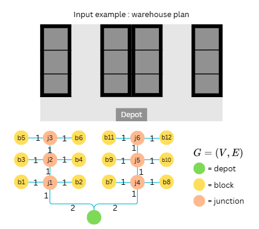
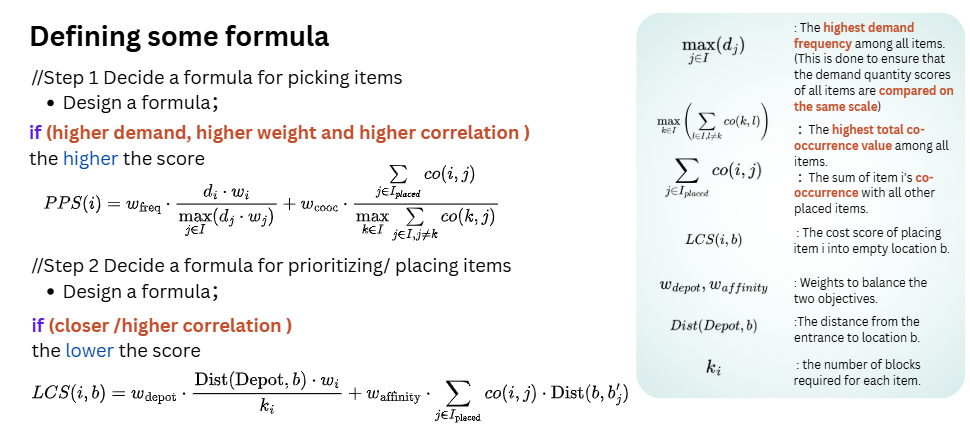
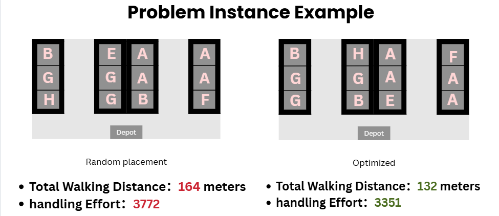

# Warehouse Item Placement Optimization  
**Less Walking, More Working**

This repository presents a **graph-based warehouse item placement algorithm** designed to reduce order-picking travel distance and physical handling effort by leveraging **historical demand patterns** and **item co-occurrence relationships**.

This project was developed as a **group project** during the **NUS Summer Workshop 2025**:

- **Course**: *Solving Real World Problems with Computational Thinking*  
- **Instructor**: Prof. Leong Hon Wai & TAs
- **Institution**: National University of Singapore (School of Computing)  
- **Team**: BLEST (T02A)  
- **Award**: *First Prize* (Group Project)

---

## Motivation

Warehouse layouts are often designed without fully considering **actual order patterns**, leading to:

- excessive walking distance,
- inefficient picking routes,
- increased worker fatigue.

By modeling the warehouse as a graph and dynamically assigning items based on **popularity, weight, and relationships**, we aim to produce layouts that are **more efficient, more ergonomic, and more realistic**.


*First Prize — NUS Summer Workshop 2025*

---

## Problem Formulation

### Warehouse Model
- The warehouse is modeled as a **graph** \( G = (V, E) \):
  - **Depot**: entry and exit point for all picking routes
  - **Blocks**: storage locations with fixed capacity
  - **Junctions**: intermediate nodes to model walking paths
- Edge weights represent **walking distances**.



*Graph-based warehouse representation with depot, junctions, and storage blocks.*

---

### Objective

We assign items to storage blocks for a given season such that:

1. **Total Walking Distance** is minimized  
2. **Handling Effort** is minimized  

These objectives are evaluated using historical customer orders.

---

## Inputs and Outputs

### Inputs
- Seasonal customer orders  
  (`CustomerID`, `ItemID`, `Amount`)
- Item attributes:
  - size (volume)
  - weight
- Warehouse layout (graph)
- Block capacity
- Historical total sales for storage planning

### Output
- A seasonal item-to-block placement plan that satisfies all constraints and minimizes cost.

---

## Constraints and Assumptions

### Constraints
- **Unique Assignment**: each block stores at most one item type
- **Storage Requirement**: each item is assigned exactly the required number of blocks
- **Fixed Locations**: block locations and warehouse layout are predefined
- **Complete Assignment**: all required storage must be allocated

### Assumptions
- Distances are computed using **shortest paths on the warehouse graph**
- No congestion or worker interference
- Sufficient total warehouse capacity
- Seasonal demand patterns are stable across years

---
## Algorithm Overview

We use a **Dynamic Greedy Algorithm** guided by two scoring functions:



---

### 1. Placement Priority Score (PPS)

Determines **which item to place next**.

$$PPS(i) = w_{\text{freq}} \cdot \frac{d_i \cdot w_i}{\max\limits_{j\in I} (d_j \cdot w_j)} + w_{\text{cooc}} \cdot \frac{\sum\limits_{j \in I_{placed}}  co(i, j)}{\max\limits_{k\in I} \sum\limits_{j \in I, j \neq k}  co(k, j)}$$

Where:
- $d_i$ : demand frequency of item $i$
- $w_i$ : weight of item $i$
- $co(i,j)$ : co-occurrence between items $i$ and $j$

High PPS -> item is important and should be placed early.

---

### 2. Location Cost Score (LCS)

Determines **where to place the selected item**.

$$LCS(i, b) = w_{\text{depot}} \cdot \frac{\text{Dist}(\text{Depot}, b) \cdot w_i}{k_i} + w_{\text{affinity}} \cdot \sum\limits_{j \in I_{\text{placed}}} co(i, j) \cdot \text{Dist}(b, b'_j)$$

Low LCS -> block is convenient for the item.

---

### Greedy Placement Loop

1. Compute PPS for all unplaced items  
2. Select item with highest PPS  
3. Compute LCS for all available blocks  
4. Assign item to block with lowest LCS  
5. Repeat until all items are placed

---

## Evaluation Metrics

### 1. Total Walking Distance
For each order:
- start at depot
- visit required blocks
- return to depot

Total walking distance is summed across all customers.

---

### 2. Handling Effort (Updated Definition)

Handling effort is calculated **per pick**, not per season total:

$$
\text{Handling Effort} =
\sum (\text{Item Weight} \times \text{Amount Picked} \times \text{Distance from Depot})
$$

This better reflects **actual physical effort** experienced by workers during picking.

---

## Results and Comparison



*Comparison between baseline layouts and algorithm-generated layouts.*

Across multiple problem instances and seasons, the algorithm consistently achieved:
- reduced total walking distance
- reduced handling effort
- more balanced and realistic layouts

---
## Reproducibility Note
- **Customer ID Sorting**: Customer IDs are processed in **natural numerical order** (e.g., P1, P2, ..., P9, P10) rather than lexicographical order. This ensures consistent evaluation as inventory is depleted sequentially.


## How to Run

### Requirements
- Python 3.8+
- Dependencies listed in `requirements.txt`

### Steps
1. **Clone the repository**
2. **Install dependencies**:
   ```bash
   pip install -r requirements.txt
   ```
3. **Run the optimization**:
   ```bash
   python src/main.py
   ```
   
   The script will:
   - Load data from `data/sample_orders.csv` and `data/sample_item_info.csv`.
   - Build the warehouse graph.
   - Run the placement algorithm.
   - Output results to console and `results/` directory.

## Results
Outputs are saved in the `results/` directory:
- `assignment.json`: Mapping of Block ID to Item ID.
- `metrics.csv`: calculated Totals for Walking Distance and Handling Effort.

## Limitations
- Greedy heuristic does not guarantee global optimality
- All blocks are assumed to have equal capacity
- No overflow or multi-item block sharing
- Evaluation is approximate and simplified

## Future Improvements
- Support variable block capacities
- Allow controlled overflow between items
- Explore metaheuristics (e.g., simulated annealing)
- Visualize layouts and picking heatmaps

## License
MIT License.
